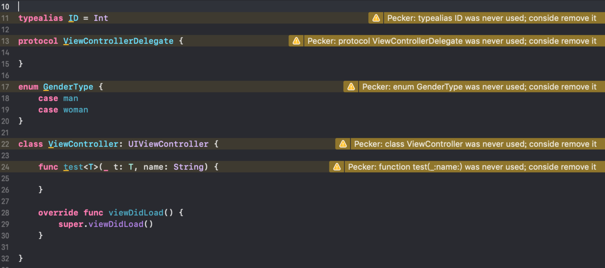
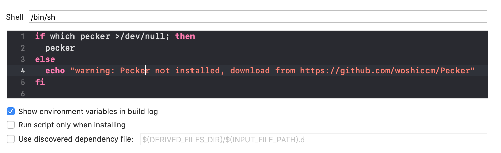
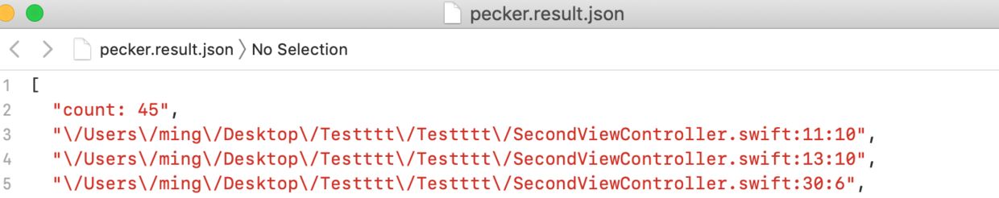

# Pecker

`pecker` is a tool to automatically detect unused code. It based on [IndexStoreDB](https://github.com/apple/indexstore-db.git) and [SwiftSyntax](https://github.com/apple/swift-syntax.git).




If you have questions, feel free to connect me, my Twitter [Roy](https://twitter.com/Roy78463507), Email: `roy.cao1991@gmail.com`. 


> Language Switch: [中文](README_CN.md).

## Why use this?

During the project development process, you may write a lot of code. Over time, a lot of code is no longer used, but it is difficult to find. `pecker` can help you locate these unused code conveniently and accurately.

## Features
`pecker` can detect the following kinds of unused Swift code.

1. class
2. struct
3. enum
4. protocol
5. function
6. typealias
7. operator

## Installation

### Using [CocoaPods](https://cocoapods.org):

```sh
pod 'Pecker'
```

This will download the Pecker binaries and dependencies in `Pods/` during your next
`pod install` execution and will allow you to invoke it via `${PODS_ROOT}/Pecker/bin/pecker`
in your Script Build Phases.

This is the recommended way to install a specific version of Pecker since it supports installing a pinned version rather than simply the latest.


### Using [Mint](https://github.com/yonaskolb/mint):

```
mint install woshiccm/Pecker

```

### Manually

```
$ git clone https://github.com/woshiccm/Pecker.git
$ cd Pecker
$ make install
```

With that installed and on our `bin` folder, now we can use it.

## Usage

### Xcode

Integrate Pecker into an Xcode scheme to get warnings and errors displayed
in the IDE. Just add a new "Run Script Phase" with:

```bash
if which pecker >/dev/null; then
  pecker
else
  echo "warning: Pecker not installed, download from https://github.com/woshiccm/Pecker"
fi
```



Alternatively, if you've installed Pecker via CocoaPods the script should look like this:

```bash
${PODS_ROOT}/Pecker/bin/pecker
```

  
### Command Line Usage

```
pecker [OPTIONS]

```

* `-v/--version`: Prints the `pecker` version and exits.
* `-i/--index-store-path`: The Index path of your project, if unspecified, the default is ~Library/Developer/Xcode/DerivedData/<target>/Index/DataStore.

Run `pecker` in the project target to detect. Project will be searched Swift files recursively.

### Rules

Current only 5 rules are included in Pecker, They are `skip_public`, `xctest`, `attributes`, `xml`, `comment`. You can add them to ` disabled_rules` if you don't need it. You can also check Source/PeckerKit/Rules directory to see their implementation.

#### skip_public
This rule means skip detect public class, struct, function, etc. Usually the public code is provided for other users, so it is difficult to determine whether it is used. So we don't detect it by default. But in some cases, such as using `submodule` to organize code, you need to detect public code, you can add it to ` disabled_rules`.

#### xctest
XCTest is special, we stipulate that ignore classes inherited from XCTestCase and functions of this class that hasPrefix "test" and do not contain parameters. 
```swift
class ExampleUITests: XCTestCase {

    func testExample() { //used
    }

    func test(name: String) { // unused
    }
    
    func get() { // unused
    }
}

```

#### attributes
If a Declaration contains the attribute in `BlackListAttribute`, skip. Such as `IBAction`, we are continuously collecting, if you find new cases, please let us know.

```swift
@IBAction func buttonTap(_ sender: Any) { // used
        
}

```

#### xml
If code is used in xib or storyboard, it also means used.

#### comment  
Code can be ignore with a comment inside a source file with the following format:

* Ignore specified code

```
// pecker:ignore 
```

For example:

```swift
// pecker:ignore
class TestCommentObject { // skip
    
    // pecker:ignore
    func test1() { // skip
    }
    
    func test2() { // unused
    }
}

```

* Ignore all symbols under scope   

```
// pecker:ignore all
```

For example:

```swift
// pecker:ignore all
class TestCommentObject { // skip
    
    func test1() { // skip
    }
    
    struct SubClass { // skip
        
        func test2() { // skip
        }
    }
}

```

#### Other rules

These rules are used by default, you cannot configure them.

**override**

Skip declarations that override another. This works for both subclass overrides & protocol extension overrides.

```swift

protocol ExampleProtocol {
	func test() // used
}

class Example: ExampleProtocol {
    func test() { // used
    }
}

class Animal {
    func run() {  // used
    }
}

class Dog: Animal {
    override func run() { // used
    }
}

```

**extensions**

Referenced elsewhere means used, except for extensions.

```swift
class UnusedExample { // unused
    
}

extension UnusedExample {
    
}

```


### Configuration

This is optinal, will use default, if unspecified. Configure `pecker` by adding a `.pecker.yml` file from the directory you'll
run `pecker` from. The following parameters can be configured:

Rule inclusion:

* `disabled_rules`: Disable rules from the default enabled set.

Reporter inclusion: 

* xcode: Warnings displayed in the IDE.
* json: Generate a json file named `pecker.result.json`, you can set path by `output_file`, if unspecified, the default is current project directory path.

   
   

```yaml
reporter: "xcode"

disabled_rules:
  - skip_public

included: # paths to include during detecting. `--path` is ignored if present.
  - ./
  
excluded: # paths to ignore during detecting. Takes precedence over `included`.
  - Carthage
  - Pods

blacklist_files: # files to ignore during detecting, only need to add file name, the file extension default is swift.
  - HomeViewController

blacklist_symbols: # symbols to ignore during detecting, contains class, struct, enum, etc.
  - AppDelegate
  - viewDidLoad

output_file: "/Users/ming/Desktop/PeckerResultDirectory"
```

  
## Contributions and support

`pecker` is developed completely in the open.

Any contributing and pull requests are warmly welcome. If you are interested in developing `pecker`, submit ideas and submit pull requests!

## Contributors

## Licence
`pecker` is released under the [MIT License](https://opensource.org/licenses/MIT).


